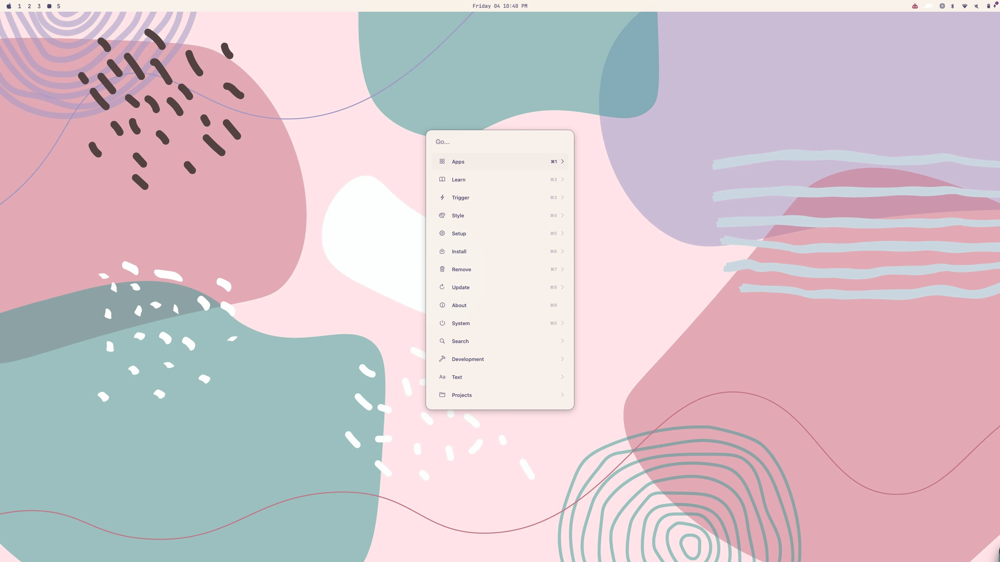
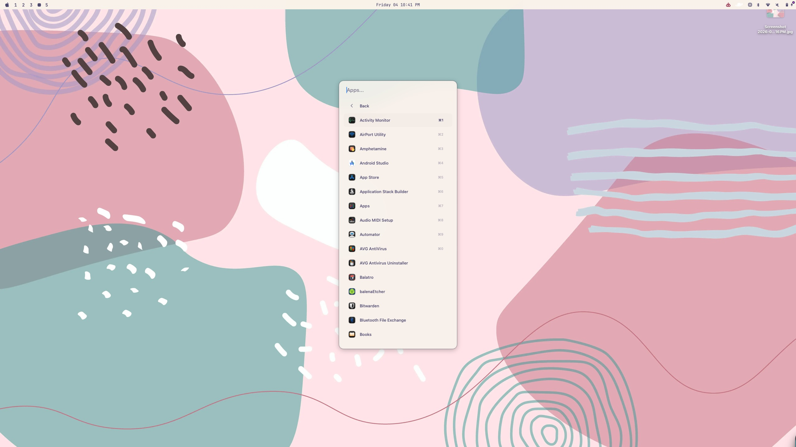

# Orbit

Orbit is a resident macOS launcher: a warm, borderless command panel that opens on a
global hotkey, in the shape of the Omarchy menu — apps, a nested command tree, search
providers, and system actions, all fuzzy-searchable from one field.

| Launcher | Search |
| --- | --- |
|  |  |

The split that makes Orbit hackable: **AppKit owns everything native — the panel,
rendering, the app index, fuzzy matching, navigation, the hotkey and IPC — and an
embedded Lua 5.4 runtime owns the data: the menu tree, actions, providers, plugins and
the theme.** Lua never describes layout, only content, so a config can restyle and
reshape the menu endlessly without ever touching Swift.

## Install

### Homebrew (recommended)

Orbit isn't in homebrew/cask — it's ad-hoc signed rather than notarized, which
wouldn't pass their review — so it ships from a personal tap instead:

```sh
brew tap mayaanhafeez/orbit https://github.com/mayaanhafeez/app_launcher
brew install --cask orbit
```

The cask (`Casks/orbit.rb`) strips the download's Gatekeeper quarantine flag
automatically as a postflight step, so the first launch isn't blocked.

### From source

```sh
git clone https://github.com/mayaanhafeez/app_launcher
cd app_launcher
scripts/build-app.sh
open .build/OrbitLauncher.app
```

`scripts/build-app.sh` is the only supported way to get a working app: it does a
release build, assembles a real `.app` bundle from `Resources/Info.plist`, stamps the
version from `git describe`, and ad-hoc codesigns it. A bare `swift build` binary has
no bundle at all, so the accessory-app behavior (`LSUIElement`, no Dock/menu-bar icon
beyond Orbit's own) and the container-relative IPC socket path never apply to it.

If you build straight from a downloaded zip instead of Homebrew (e.g. a GitHub release
asset), macOS will quarantine it and refuse to open it ("OrbitLauncher.app is damaged
and can't be opened" / "cannot verify developer"). Clear the flag yourself, or
right-click the app and choose Open once to bypass Gatekeeper for that copy:

```sh
xattr -dr com.apple.quarantine .build/OrbitLauncher.app   # or wherever you unzipped it
```

This isn't a security workaround to take lightly — only do it for builds you trust.
There's no Developer ID certificate behind these builds, so there's nothing else
vouching for them.

## First launch: permission prompts

Orbit will ask for two permissions the first time it needs them:

- **Accessibility** — required for the global hotkey to work system-wide.
- **Automation** — required for AppleScript-driven actions (`applescript` items,
  Terminal-launched `shell` commands, and anything using the `osascript`/`terminal`
  Lua helpers).

Grant both under System Settings → Privacy & Security. **Expect to be asked again
after every rebuild.** Ad-hoc signing (`codesign --force --sign -`) produces a
signature that's derived from the bundle's contents, so it changes on every build; TCC
ties Accessibility/Automation grants to that signature, and a changed signature reads
as a different, ungranted app. This is expected behavior for an ad-hoc signed app, not
a bug — a Developer ID–signed, notarized build wouldn't have this problem, but this
project doesn't have one.

## Using it

The default hotkey is **Option-Space**. Press it to open the panel, type to fuzzy
search, arrow keys or `j`/`k` (in [vim mode](docs/configuration.md#settings)) to move,
Return to activate, Escape to go back a level or dismiss. **Tab** (or ⌘-Return) on the
selected row opens its [actions](docs/configuration.md#row-actions) — Reveal in Finder,
Copy Path, Open With… — and Escape returns to the list with your query intact.

Orbit has no Dock icon or window outside the panel itself; the only persistent UI is
a **menu bar item** (a dashed-circle glyph) with:

- **Open Config Folder** — creates and opens `~/.config/orbit` if it doesn't exist yet
- **Reload Config** — force a reload without waiting on the file watcher
- **Open at Login** — toggles launch-at-login (`SMAppService`); its checkmark reflects
  whatever System Settings currently has it set to, even if that changed outside Orbit
- **Quit Orbit**

To change the hotkey, edit `hotkey` in `config.lua` — see
[docs/configuration.md](docs/configuration.md#settings) for the key/modifier
vocabulary. Both `config.lua` and `theme.lua` reload automatically on save.

## Configuration

```sh
mkdir -p ~/.config/orbit
cp Config/config.lua Config/theme.lua ~/.config/orbit/
cp -r Config/plugins ~/.config/orbit/
```

- `~/.config/orbit/config.lua` — the menu tree, actions, providers, settings. Rebuilds
  the whole menu state on save.
- `~/.config/orbit/theme.lua` — colors, spacing, typography. Runs in a separate,
  more restricted Lua state and can only restyle the panel, never touch the menu.
- `~/.config/orbit/plugins/`, `~/.config/orbit/lua/` — anywhere else you `require`
  from `config.lua`, the way a Neovim config splits across files.

A missing `config.lua` falls back to a small built-in menu (Apps / System / Tools), so
Orbit is usable before you've written anything.

**The full Lua reference — every item field, action kind, the provider sandbox, every
theme token, palettes, and a worked plugin example — lives in
[docs/configuration.md](docs/configuration.md).** This README stays intentionally
thin; that's where the detail belongs.

## `orbitctl`

A small CLI that drives a running Orbit instance over a Unix socket
(`~/Library/Containers/com.orbit.launcher/Data/tmp/orbit.sock`, mode `0600`), one
request/response per connection:

```sh
orbitctl ping                 # "ok" if Orbit is running
orbitctl toggle [route]       # open the panel at route, or close it if already open
orbitctl show [route]         # open the panel at route (default: root)
orbitctl hide                 # close the panel
orbitctl reload               # force a config/theme reload
orbitctl invoke <node-id>     # run a node's action without opening the panel
orbitctl theme                # report the palette name currently in effect
orbitctl version              # report the running app's version
```

`route` is an item's `id` or one of its `aliases`, case-insensitive, with underscores
normalized to dashes; an exact id wins over an alias, and an unknown route opens root.
`invoke` needs an exact node id and fails on a category (submenu) or unknown id.

```sh
swift run orbitctl toggle     # from a source checkout, without installing orbitctl
```

## Building and testing

```sh
swift build                              # debug build of both executables
scripts/build-app.sh                     # release build + .build/OrbitLauncher.app
swift test                               # swift-testing suite
swift test --filter fuzzyMatching        # a single test
```

There's no linter or formatter configured.

## License

MIT — see [LICENSE](LICENSE).
