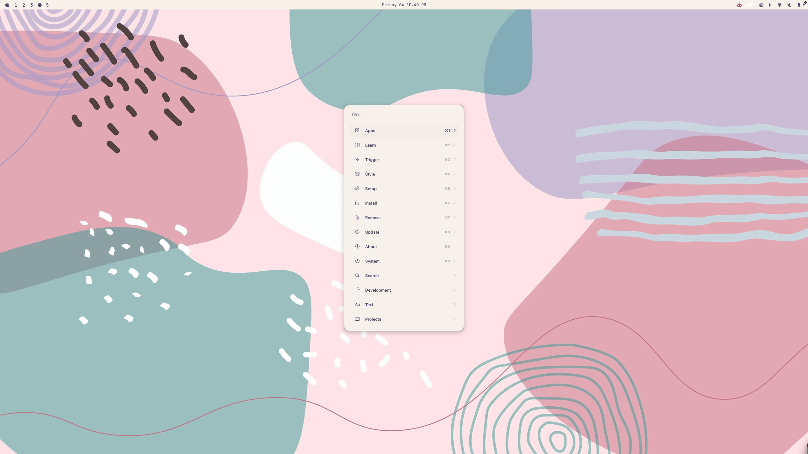
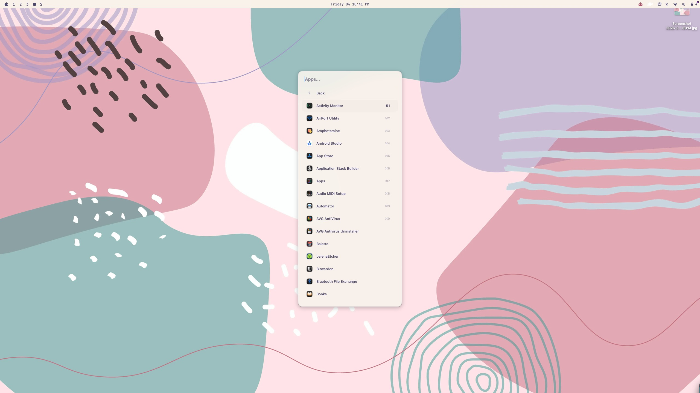
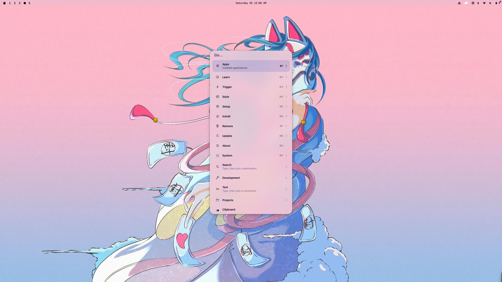
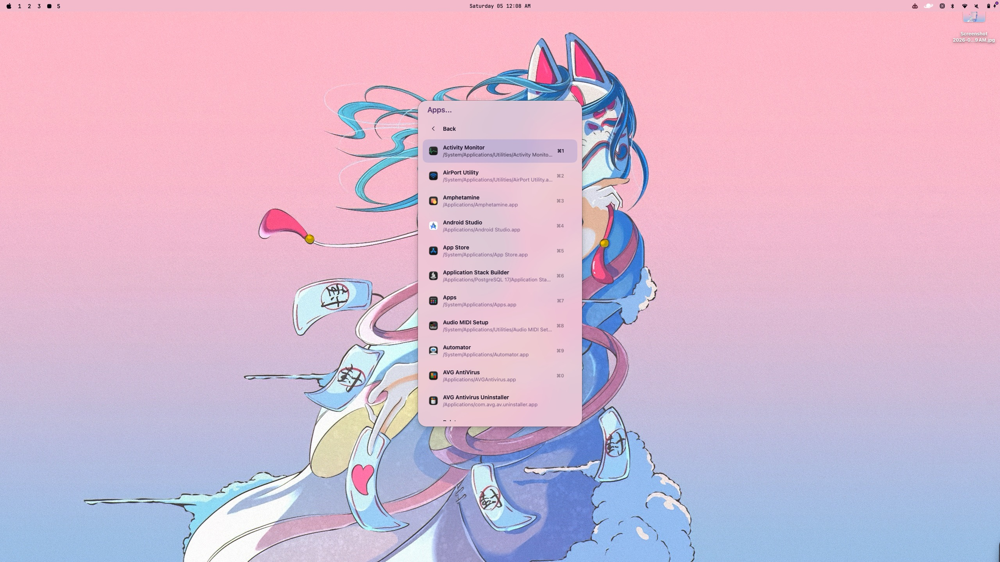
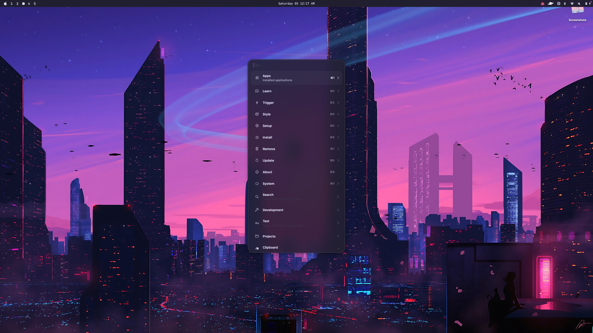

# Kitsune

Kitsune is a resident macOS launcher: a warm, borderless command panel that opens on a
global hotkey, in the shape of the Omarchy menu — apps, a nested command tree, search
providers, and system actions, all fuzzy-searchable from one field.

<p>
  
  
</p>
<p>
  
  
</p>
<p>
  
  
</p>

The split that makes Kitsune hackable: **AppKit owns everything native — the panel,
rendering, the app index, fuzzy matching, navigation, the hotkey and IPC — and an
embedded Lua 5.4 runtime owns the data: the menu tree, actions, providers, plugins and
the theme.** Lua never describes layout, only content, so a config can restyle and
reshape the menu endlessly without ever touching Swift.

## Install

```sh
brew tap mayaanhafeez/kitsune https://github.com/mayaanhafeez/app_launcher
brew install --cask kitsune
```

The cask installs `KitsuneLauncher.app`, links `kitsunectl` onto your `PATH`, and clears
the download's Gatekeeper quarantine flag so the first launch isn't blocked (builds are
ad-hoc signed, not notarized). Kitsune isn't in homebrew/cask, which wouldn't accept an
un-notarized app, so it ships from this repo as a tap.

Updates come through Homebrew too — Kitsune has no updater of its own:

```sh
brew upgrade --cask kitsune
```

Your config is never touched by an install or an upgrade.

### From a release zip

Each [release](https://github.com/mayaanhafeez/app_launcher/releases) carries the zip the
cask installs. Downloaded directly, macOS quarantines it and refuses to open it ("damaged
and can't be opened" / "cannot verify developer"). Clear the flag yourself — only for a
build you trust, since no Developer ID vouches for it:

```sh
xattr -dr com.apple.quarantine /Applications/KitsuneLauncher.app
```

A zip install has no update path: download the next release the same way.

### From source

```sh
git clone https://github.com/mayaanhafeez/app_launcher
cd app_launcher
scripts/build-app.sh
open .build/KitsuneLauncher.app
```

To update a source build, `git pull && scripts/build-app.sh`.

`scripts/build-app.sh` is the only supported way to get a working app: it does a
release build, assembles a real `.app` bundle from `Resources/Info.plist`, stamps the
version from `git describe`, bundles the config templates, and ad-hoc codesigns it. A
bare `swift build` binary has no bundle at all, so the accessory-app behavior
(`LSUIElement`, no Dock/menu-bar icon beyond Kitsune's own), the container-relative IPC
socket path and first-launch config seeding never apply to it.

## First launch: permission prompts

Kitsune will ask for two permissions the first time it needs them:

- **Accessibility** — required for the global hotkey to work system-wide.
- **Automation** — required for AppleScript-driven actions (`applescript` items,
  Terminal-launched `shell` commands, and anything using the `osascript`/`terminal`
  Lua helpers).

Grant both under System Settings → Privacy & Security. **Expect to be asked again
after every rebuild.** Ad-hoc signing (`codesign --force --sign -`) produces a
signature that's derived from the bundle's contents, so it changes on every build; TCC
ties Accessibility/Automation grants to that signature, and a changed signature reads
as a different, ungranted app. This is expected behavior for an ad-hoc signed app, not
a bug — a Developer ID–signed, notarized build wouldn't have this problem, but this
project doesn't have one.

## Using it

The default hotkey is **Option-Space**. Press it to open the panel, type to fuzzy
search, arrow keys or `j`/`k` (in [vim mode](docs/configuration.md#settings)) to move,
Return to activate, Escape to go back a level or dismiss. **Tab** (or ⌘-Return) on the
selected row opens its [actions](docs/configuration.md#row-actions) — Reveal in Finder,
Copy Path, Open With… — and Escape returns to the list with your query intact.

Typing a path — anything starting `/` or `~` — turns the list into a directory
listing instead: Return on a folder browses into it, Return on a file opens it, and
Tab still gives you Reveal in Finder / Copy Path / Open With. See
[`files`](docs/configuration.md#files).

Kitsune has no Dock icon or window outside the panel itself; the only persistent UI is
a **menu bar item** (a dashed-circle glyph) with:

- **Open Config Folder** — creates and opens `~/.config/kitsune` if it doesn't exist yet
- **Reload Config** — force a reload without waiting on the file watcher
- **Open at Login** — toggles launch-at-login (`SMAppService`); its checkmark reflects
  whatever System Settings currently has it set to, even if that changed outside Kitsune
- **Quit Kitsune**

To change the hotkey, edit `hotkey` in `config.lua` — see
[docs/configuration.md](docs/configuration.md#settings) for the key/modifier
vocabulary. Both `config.lua` and `theme.lua` reload automatically on save.

## Configuration

On first launch Kitsune copies the templates in `Config/` to `~/.config/kitsune`. It
only does this when `~/.config/kitsune/config.lua` doesn't exist, and never overwrites a
file, so edits survive every rebuild. To start over, move `config.lua` aside and relaunch
(or choose **Open Config Folder**): the missing files are copied back in, and anything
already there is left alone.

The shipped config only uses what a bare Mac has. A few plugins are included but off,
because they need something installed first — `projects`, `aerospace`, `themes` (driven
by `set-theme`) and the annotated `example`; add a name to `plugins` in `config.lua` to
turn one on.

- `~/.config/kitsune/config.lua` — the menu tree, actions, providers, settings. Rebuilds
  the whole menu state on save.
- `~/.config/kitsune/theme.lua` — colors, spacing, typography. Runs in a separate,
  more restricted Lua state and can only restyle the panel, never touch the menu.
- `~/.config/kitsune/plugins/`, `~/.config/kitsune/lua/` — anywhere else you `require`
  from `config.lua`, the way a Neovim config splits across files. Saving any `.lua` file
  below `~/.config/kitsune` reloads, so a split config hot-reloads like a single one.
- `~/.config/kitsune/colour_schemes/` — the shipped palettes; set `palette = "<name>"` in
  `theme.lua` to pick one (the default is `kitsune`). A scheme name is looked up **only**
  here, in `~/.config/kitsune/themes/` and in the `palette_paths` your `theme.lua` lists;
  nothing under `~/omarchy` or `~/.config/{kitty,ghostty,btop}` is read unless you name it
  in `palette_paths`. To override a shipped scheme, put a file of the same name in
  `~/.config/kitsune/themes/`, which is searched first.

If `config.lua` is missing anyway (a bare `swift build` binary has no templates to
copy), Kitsune falls back to a small built-in menu (Apps / System / Tools).

**The full Lua reference — every item field, action kind, the provider sandbox, every
theme token, palettes, and a worked plugin example — lives in
[docs/configuration.md](docs/configuration.md).** This README stays intentionally
thin; that's where the detail belongs.

## Agent skills

`agent/` is a Claude Code plugin with two skills, so a coding agent can work on your
config without reading the source first:

- **kitsune-config** — editing `~/.config/kitsune`: menus, settings, hotkeys, theme,
  and checking the result with `kitsunectl reload`.
- **kitsune-plugin** — writing a plugin: when to use a provider, a command menu or an
  action, the sandbox rules a provider has to follow, and how to test it.

```sh
claude plugin marketplace add mayaanhafeez/app_launcher
claude plugin install kitsune@kitsune
```

The skills are plain `SKILL.md` folders under `agent/skills/`, so any agent that
reads the [Agent Skills](https://agentskills.io) format can use them — copy them
wherever yours looks.

## `kitsunectl`

A small CLI that drives a running Kitsune instance over a Unix socket
(`~/Library/Containers/com.kitsune.launcher/Data/tmp/kitsune.sock`, mode `0600`), one
request/response per connection:

```sh
kitsunectl ping                 # "ok" if Kitsune is running
kitsunectl toggle [route]       # open the panel at route, or close it if already open
kitsunectl show [route]         # open the panel at route (default: root)
kitsunectl hide                 # close the panel
kitsunectl reload               # reload config/theme; exits non-zero with the Lua error
kitsunectl invoke <node-id>     # run a node's action without opening the panel
kitsunectl theme                # report the palette name currently in effect
kitsunectl version              # report the running app's version
```

`route` is an item's `id` or one of its `aliases`, case-insensitive, with underscores
normalized to dashes; an exact id wins over an alias, and an unknown route opens root.
`invoke` needs an exact node id and fails on a category (submenu) or unknown id.

It ships inside the app at `KitsuneLauncher.app/Contents/MacOS/kitsunectl`; the Homebrew
cask links it onto your `PATH`. From a source build, link it yourself or go through
SwiftPM:

```sh
ln -s "$PWD/.build/KitsuneLauncher.app/Contents/MacOS/kitsunectl" /usr/local/bin/kitsunectl
swift run kitsunectl toggle     # from a source checkout, without linking anything
```

## Building and testing

```sh
swift build                              # debug build of both executables
scripts/build-app.sh                     # release build + .build/KitsuneLauncher.app
swift test                               # swift-testing suite
swift test --filter fuzzyMatching        # a single test
```

There's no linter or formatter configured.

## Releasing

Push a tag from `main`; the [release workflow](.github/workflows/release.yml) does the rest:

```sh
git tag v1.0.0 && git push origin v1.0.0
```

It runs the tests, builds the zip (`scripts/release.sh`), attaches it to a GitHub
release, and rewrites `version` and `sha256` in `Casks/kitsune.rb` on `main`
(`scripts/bump-cask.sh`). This repo is the Homebrew tap, so that commit is the whole of
publishing: the next `brew upgrade` installs it. A tag with a hyphen (`v1.1.0-rc.1`) is
published as a GitHub pre-release and never touches the cask.

## License

MIT — see [LICENSE](LICENSE).
